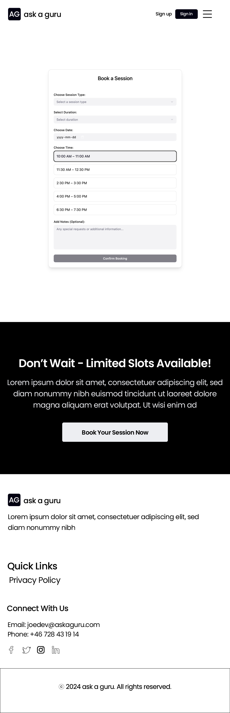

# ask-a-guru

## Overview
Ask a Guru is a streamlined, full-stack web application designed to connect users with a creative expert for one-on-one sessions.  
Users can browse sessions, book preferred time slots, and manage bookings via a personal dashboard.  
The expert can manage session offerings and bookings (optionally via Django Admin).  
Built with Django, PostgreSQL, and Bootstrap, following Agile methodology and UX best practices.  
Fully responsive and focused on a seamless booking experience.

[Back To Top](#ask-a-guru)

---

## Agile Methodology
This project follows Agile principles and uses **GitHub Projects** to plan and track progress.  
Work is organized into **Epics** and **User Stories**, prioritized using **MoSCoW** (Must/Should/Could/Won’t).

[Back To Top](#ask-a-guru)

---

## User Experience (UX)

### Strategy / Site Goals
- Simple, intuitive booking experience for users.  
- Efficient expert tools to create/manage sessions and bookings.  
- Accessibility, responsiveness, and clarity across devices.

### Scope / User Stories

#### Epics & User Stories – Ask a Guru Project 4

##### Epic 1: Authentication
**Goal:** Enable both users and the expert to log in securely. Regular users can register, log in, and manage bookings, while the expert has a dedicated login and access to a custom dashboard. All credentials are protected using Django’s built-in authentication and hashing system.  
**User Stories:**
- As an expert, I want to log in through a dedicated form and be redirected to my dashboard to manage sessions.
- As a user, I want to register an account so that I can book sessions.
- As a user, I want to log in and log out so that my information remains secure.
- As a developer, I want to store passwords securely using Django's built-in hashing system.
- As a developer, I want to protect sensitive keys by using environment variables and .env files.  
**MoSCoW Priority:** Must Have  
**Related to:** Django Auth, Security, Environment Configuration, Expert Dashboard

##### Epic 2: Session Booking System
**Goal:** Allow users to browse available creative sessions and book one with ease.  
**User Stories:**
- As an expert, I want to create, edit, and delete session offers so that I can manage the availability of my services.
- As a user, I want to view a list of available sessions so that I can choose the one I prefer.
- As a user, I want to view session details so that I understand what the session offers.
- As a user, I want to book a session so that I can receive creative support.  
**MoSCoW Priority:** Must Have  
**Related to:** Session Model, Booking Logic, UI Display, Expert Dashboard

##### Epic 3: User Dashboard
**Goal:** Provide each user with a personal dashboard where they can manage and track their bookings, and enable the expert (admin) to manage all user bookings through a dedicated expert dashboard.  
**User Stories:**
- As an expert, I want to view all user bookings from a frontend dashboard so that I can manage the session schedule.
- As an expert, I want to update or cancel user bookings from my dashboard to reflect real-time changes.
- As a user, I want to view my bookings so that I can track and manage them.
- As a user, I want to cancel a booking in case my schedule changes.
- As a user, I want to edit a booking so that I can update my selection if needed.  
**MoSCoW Priority:** Must Have  
**Related to:** User Profile, CRUD, Admin Dashboard, Session Management

##### Epic 4: CRUD Functionality
**Goal:** Ensure full frontend-based Create, Read, Update, and Delete operations for user bookings in a seamless and user-friendly way, and provide the expert with full control over all bookings through a dedicated dashboard.  
**User Stories:**
- As an expert, I want to view all booking details in a clear and organized format to make informed decisions.
- As a user, I want to create a booking from the session detail page.
- As a user, I want to view my current bookings so I can keep track of upcoming sessions.
- As a user, I want to update a booking from my dashboard.
- As a user, I want to cancel a booking in case my schedule changes.
- As a user, I want to permanently delete a booking so that it is removed from my dashboard.
- As a user, I want confirmation messages when I complete an action successfully.
- As a developer, I want to ensure that user input is validated to prevent form submission errors.  
**MoSCoW Priority:** Must Have  
**Related to:** Dashboard, Forms, Django Views, Validation, Expert Dashboard Controls

##### Epic 5: Frontend UI/UX Design
**Goal:** Design a clean, modern, and responsive interface using Bootstrap to enhance user experience.  
**User Stories:**
- As an expert, I want a clean and functional dashboard UI so that I can manage sessions easily.
- As a user, I want a simple and visually appealing layout so that I can use the platform easily.
- As a user, I want the interface to be responsive so I can use it on any device.
- As a user, I want intuitive navigation so I can find pages and features easily.
- As a user, I want readable text and accessible color contrasts so I can use the app comfortably.
- As a developer, I want to use Bootstrap components to speed up design and ensure responsiveness.  
**MoSCoW Priority:** Must Have  
**Related to:** Bootstrap, Layout, Mobile Responsiveness, Expert Dashboard

##### Epic 6: Deployment & Hosting
**Goal:** Deploy the application online to make it accessible to users at any time.  
**User Stories:**
- As a developer, I want to deploy the application to Heroku so that it is accessible online.
- As a user, I want the website to load quickly and be consistently available.
- As a developer, I want to hide the SECRET_KEY and database credentials before pushing to GitHub.
- As a developer, I want to configure the Procfile, requirements.txt, and allowed hosts properly for Heroku deployment.
- As a developer, I want to collect and serve static files correctly so that the frontend displays as expected after deployment.  
**MoSCoW Priority:** Must Have  
**Related to:** Heroku, GitHub, Environment Variables, Static Files, Deployment Config

##### Epic 7: Agile Planning & Workflow
**Goal:** Manage the development process using Agile methodology and GitHub Projects.  
**User Stories:**
- As a developer, I want to create wireframes for all pages before implementing both the frontend and backend, so that I can plan the layout, functionality, and user experience properly.
- As a developer, I want to manage all tasks using GitHub Projects so that I can plan and track my progress clearly.
- As a team member, I want to prioritize features using the MoSCoW method to focus on what matters most.
- As a developer, I want to break the project into Epics and User Stories so that each task has clear goals.
- As a developer, I want to organize tasks using columns like "To Do", "In Progress", and "Done" to monitor the workflow visually.
- As a developer, I want to update the status of each task regularly to stay aligned with my plan and timeline.  
**MoSCoW Priority:** Must Have  
**Related to:** GitHub Project Board, Workflow Organization, MoSCoW Method, Agile Methodology

##### Epic 8: Testing & Quality Assurance
**Goal:** Test the platform thoroughly and ensure a high-quality user experience across all devices, using manual testing methods.  
**User Stories:**
- As a user, I want to test each feature to ensure it works as expected.
- As a user, I want clear messages confirming successful actions like booking or cancellation.
- As a developer, I want to perform manual testing for all pages and actions.
- As a developer, I want to document my testing steps clearly in the README file.
- As a developer, I want to verify that the site looks good and works properly across different screen sizes.  
**MoSCoW Priority:** Must Have  
**Related to:** Quality Assurance, Manual Testing, Responsive Design, README

---
## Skeleton / Wireframes
Below are the wireframes for the main pages of the "Ask a Guru" project.  
Each page includes a desktop (d) and mobile (m) version.

 

Wireframes

### Home Page
  

 

### Sign Up Page
  

 

### Sign In Page
  

 

### User Dashboard
  

 

### Session Booking Page
  

 

---
## Surface

This section defines the visual language of the **Ask a Guru** platform.

- **Colour Scheme**  

The color palette is taken directly from the wireframe designs to ensure consistency between planning and implementation.  
It follows a clean, modern style with a white background, dark text, and subtle grays for structure, while green and red alerts are used to give clear visual feedback.

---
| Color | Hex Code | Color Name       | Usage                                          |
|-------|----------|------------------|-----------------------------------------------|
|  | #FFFFFF  | White            | Background                                    |
|  | #000000  | Black            | Primary text & dark buttons                   |
|  | #F8F9FA  | Light Gray       | Section backgrounds & card borders            |
|  | #198754  | Bootstrap Green  | Success alerts (e.g., booking confirmed)       |
|  | #DC3545  | Bootstrap Red    | Error/Delete alerts (e.g., booking cancelled)  |
|  | #0D6EFD  | Bootstrap Blue   | Links, primary buttons                         |

---

- **Typography**  

The website uses the **Roboto** font in various weights for a clean and modern appearance:  
- **400 (Regular)** for body text  
- **500 (Medium)** for subheadings  
- **700 (Bold)** for headings and section titles  

Roboto is chosen for its excellent readability and modern look, especially on both desktop and mobile screens.

---

- **Icons**  

The platform uses **Bootstrap Icons** for navigation, social media links, and alerts.  
They are implemented with accessibility in mind, using `aria-label` attributes to ensure they are screen reader friendly.

---

- **Buttons**  

Buttons follow a **high-contrast logic** for maximum visibility:  
- **If the background is white** → Button is **black** with **white text**.  
- **If the background is black** → Button is **white** with **black text**.  

This ensures optimal readability and a clean, modern look across all sections.

---

- **Feedback Colors (Bootstrap Alerts)**  

- **Green (#198754)** for success messages (e.g., “Booking Confirmed”).  
- **Red (#DC3545)** for error or deletion confirmations (e.g., “Booking Cancelled”).  

[Back To Top](#)